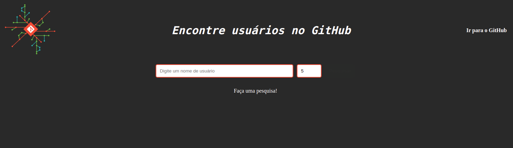

<h1 align="center" id="welcome">Welcome to the Search GitHub Users repository!</h1>


<div align="center">
  <a href="#about">About</a>
  <span> | </span>  
   <a href="#technologies">Technologies</a>
  <span> | </span>  
   <a href="#features">Features</a>
  <span> | </span>  
   <a href="#APIs">APIs</a>
  <span> | </span>
  <a href="#prerequisites">Prerequisites</a>
  <span> | </span>  
   <a href="#installation">Installation</a>
  <span> | </span>  
  <a href="#author">Author</a>
  <span> | </span>  
  <a href="#license">License</a>  
</div>

<h1 id="about">💬 About</h1>
<p>Project carried out to train the reading of API documentation, use of React and Redux. It has a simple operation, being possible to search GitHub users by username. The application informs the user's basic data and that person's public repositories.</p>

<h1 id="technologies">:rocket: Technologies</h1>

- [React](https://reactjs.org)
- [Redux](https://redux.js.org/)

<h1 id="features">🛠️ Features</h1>

- [X] Search GitHub users by username;
- [X] Choose number of users returned in the search;
- [X] View Basic User Information;
- [X] View list of user's public repositories.

<h1 id="APIs">☁️ APIs</h1>

- [GitHub](https://docs.github.com/en/rest/reference/users)

<h1 id="prerequisites">💻 Prerequisites</h1>

- [Node.js](https://nodejs.org/en/download/)
- [Git](https://git-scm.com/downloads)

<h1 id="installation">📋 Installation</h1>

To install Search GitHub Users, follow these steps:

- Linux and macOS:

```
# Step 1: Clone the repository
$ git clone https://github.com/SamuelSilvaMelo/search-github-users.git

# Step 2: Enter the repository folder you just cloned:
$ cd search-github-users

# Step 3: Install dependencies:
$ npm install

# Step 4: Start the project:
$ npm start 

# Step 5: A new page should open in your browser automatically.
```

<h1 id="author">Author</h1>

<div>
  <a href="https://github.com/SamuelSilvaMelo">
    
  </a>
  <p>
    Made with &#10084; by <a href="https://github.com/SamuelSilvaMelo">Samuel Melo</a>, Contact! &#128075;
  </p>
</div>

<h1 id="license">📝 License</h1>

[Copyright](./LICENSE) (c) 2021 Samuel Silva Melo by MIT License.

<a href="#welcome">⬆ Scroll To Top</a>
